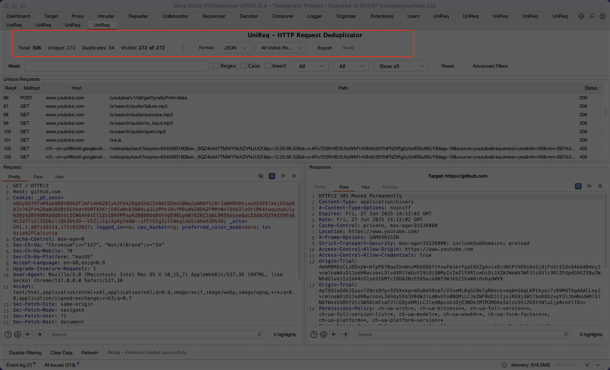

# UniReq – HTTP Request Deduplicator for Burp Suite

**UniReq** is a Burp Suite extension that helps security professionals efficiently deduplicate and analyze HTTP traffic. It provides high-performance filtering, smart grouping, and one-click exports — ideal for bug bounty, pentests, and large-scale recon.

---

## Features

- **Deduplication of HTTP Requests** — track only unique requests as traffic flows through the proxy
- **Host, Method, Status & MIME Type Filtering** — narrow down the request table in real-time
- **Regex, Case-Sensitive, and Invert Toggles** — flexible pattern matching for host and path filters
- **Advanced Filters** — per-method, per-status-range, file extension include/exclude, scope restriction
- **Export to JSON, CSV, and Markdown** — one-click export of visible results with metadata
- **Burp Scope Integration** — optionally restrict tracking to in-scope targets only
- **Native Burp Settings Panel** — advanced filter settings accessible from Burp's Settings dialog

---

## Installation

### From the BApp Store

1. Open Burp Suite Pro
2. Go to **Extensions → BApp Store**
3. Search for **UniReq** and click **Install**

### Manual Installation (from JAR)

1. Download the latest JAR from the [Releases page](https://github.com/Johnfire45/UniReq/releases)
2. Open Burp Suite Pro
3. Go to **Extensions → Extensions** tab
4. Click **Add**
5. Set **Extension type** to **Java**
6. Click **Select file** and choose the downloaded `unireq-deduplicator-1.0.0.jar`
7. Click **Next** — the UniReq tab will appear in Burp's main tab bar

**Requirements:** Burp Suite Pro v2023.12 or later (the extension uses the Montoya API).

---

## How to Use

1. Browse your target — UniReq automatically captures unique requests passing through the proxy
2. The **UniReq tab** shows a live table of unique requests with method, host, path, status, and timestamp
3. Use the **filter bar** at the top to narrow results by host pattern, HTTP method, or status code
4. Click **Advanced Filters** to set MIME type, file extension, or scope filters
5. Select one or more rows and use the **viewer pane** to inspect request/response details
6. Click **Export** to save the current table view to JSON, CSV, or Markdown

---

## UI Preview



---

## How Deduplication Works

UniReq generates a **SHA-256 fingerprint** for each intercepted request using:

```
METHOD | HOST | NORMALIZED_PATH | SHA-256(CONTENT)
```

- **METHOD** — HTTP verb (GET, POST, etc.)
- **HOST** — the target hostname from the HTTP service
- **NORMALIZED_PATH** — lowercase path with trailing slashes removed
- **CONTENT hash** — SHA-256 of the request body (POST/PUT/PATCH) or query string (GET); binary bodies and bodies over 1 MB are excluded

Two requests are considered duplicates if they produce the same fingerprint. Request headers (other than the host) are intentionally **not** included in the fingerprint, so requests that differ only in `User-Agent`, `Cookie`, or similar headers are treated as duplicates.

---

## Known Limitations

- **Headers not fingerprinted** — changes to `Authorization`, `Cookie`, or other headers do not produce a new unique entry
- **1000-entry cap** — the oldest entries are evicted once 1000 unique requests are stored (FIFO); data is not persisted across Burp restarts
- **No persistence** — closing or reloading Burp clears all tracked requests
- **HTTP/1.x-centric** — the fingerprint format assumes standard HTTP/1.x request structure

---

## Troubleshooting / FAQ

**Q: UniReq isn't capturing any requests.**  
A: Make sure the **Enable** toggle in the UniReq tab is turned on and that traffic is flowing through Burp's proxy listener.

**Q: The table is empty even though I can see requests in the Proxy history.**  
A: Check whether a scope filter is active (Advanced Filters → Options → "Show only in-scope items") and whether the target is added to Burp's scope.

**Q: Clicking Reset doesn't clear the Advanced Filters panel.**  
A: Upgrade to the latest version — this was fixed in v1.0.0.

**Q: Why do I see the same endpoint twice with different parameters?**  
A: UniReq deduplicates by path + body hash. Different query strings or POST bodies produce different fingerprints, so both entries are expected.

**Q: Can I export only the filtered results?**  
A: Yes — the Export button exports whatever is currently visible in the table after filters are applied.

---

## Release Info

- **Latest Version**: `v1.0.0`
- **Built With**: [Burp Montoya API](https://portswigger.net/burp/extender/api)
- **Compatible With**: Burp Suite Pro v2023.12 and above
- **License**: MIT

---

## Security Notes

- No external network calls
- Fully offline-capable
- Sensitive headers (Authorization, Cookie, X-API-Key) are redacted in the request preview pane
- No reflection, no eval, no unsafe deserialization

---

## For Developers

```bash
# Clone and build
git clone https://github.com/Johnfire45/UniReq.git
cd UniReq
mvn clean package
# Output: target/unireq-deduplicator-1.0.0.jar
```

**Requirements:** Java 11+, Maven 3.6+

The Montoya API is declared as `provided` scope and excluded from the shaded JAR — Burp provides it at runtime.

See [CLAUDE.md](CLAUDE.md) for architecture details and design decisions.
